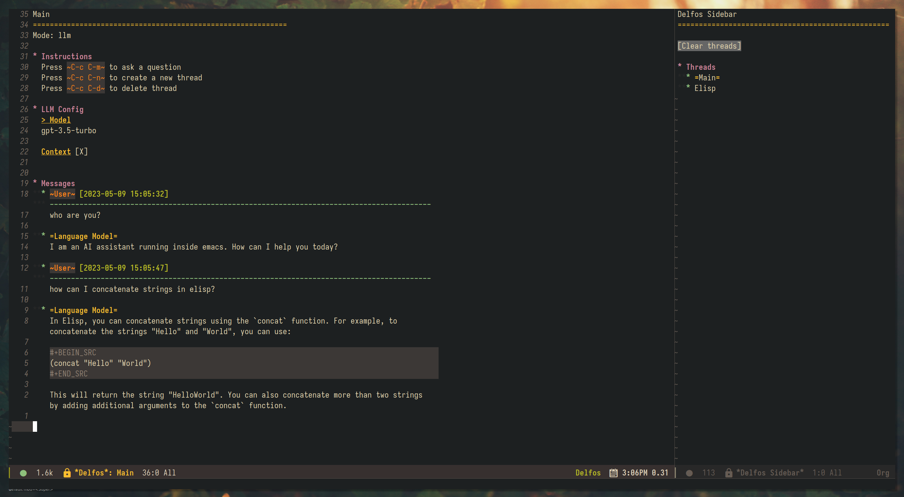

# delfos.el

An emacs framework for AI interaction.



### Features 

- Extensible chat interface with multiple threads
- The system understands it's within emacs and responds accordingly
- Chat displays in org-mode and code blocks can be evaluated
- Copilot functions from anywhere in Emacs 
  - Modify selected region using a LLM
  - Ask about selected region to a LLM

## Configuration

### Example Doom Emacs configuration

```elisp
(add-to-list 'load-path "[delfos folder]")

(map! :leader
      (:prefix ("a" . "delfos")
       :desc "modify region" "m" #'delfos-copilot-ask-modify-region
       :desc "modify region (file ctx)" "M" #'delfos-copilot-ask-modify-region-with-file-context
       :desc "ask (prompt)" "i" #'delfos-copilot-ask
       :desc "ask (buffer)" "I" #'delfos-copilot-ask-with-input-buffer
       :desc "open delfos menu" "o" #'delfos-start
       :desc "load thread" "l" #'delfos-thread-load
       :desc "ask about region" "a" #'delfos-copilot-ask-about-region))
```

## Extending Delfos

Delfos can easily extended by adding a new [backend](./delfos-backend.el) ([example](./backends/delfos-openai.el)) or [modus](./delfos-modus.el) ([example](./delfos-llm.el)).
